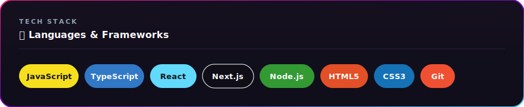
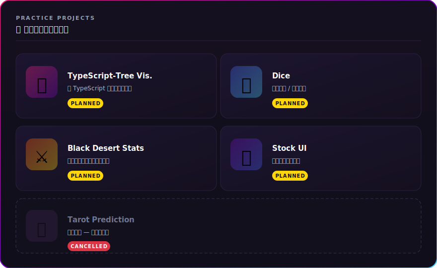
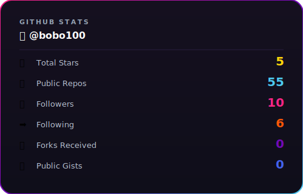
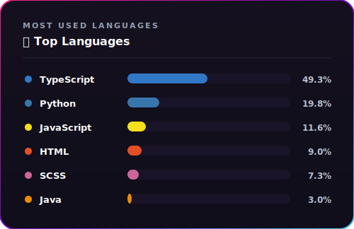
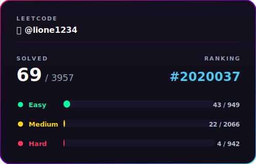

<p align="center">
  
</p>

---

## 🧑‍💻 個人資料

```yaml
name:    "Bobo"
email:   "w150lione@gmail.com"
blog:    "https://bobo-blog.vercel.app/   # In maintenance"
role:    "Frontend Developer"
hobbies: ["coding", "gaming", "youtube"]
```

---

## 📖 簡介

> *凡人持續努力。*
>
> 最近學到的經驗:確診真的非常非常痛苦!!!

---

## 🛠️ Tech Stack

<p align="left">
  
</p>

---

## 🚀 準備進行的個人練習

<p align="center">
  
</p>

---

## 📺 Latest YouTube Videos

<!-- YOUTUBE:START -->
- [【百百】嘶嘶~蛇快要可以穿鞋了🤩](https://www.youtube.com/shorts/6VbUxv9WhYY)
- [【百百】最近迷上在你的鼻孔尿尿 #lolshorts  #lol  #大混戰 #Montagem Miau](https://www.youtube.com/shorts/VKizxgLEfWA)
- [【百百】各位聖誕節快樂🎅🎄🎁 #lolshorts  #lol  #大混戰](https://www.youtube.com/shorts/BOBi8qI_fJ4)
- [【百百】連敗列車是誰害的? #lolshorts  #lol  #leagueoflegends](https://www.youtube.com/shorts/y-r_SJ5ORec)
- [【百百】音不準 #lolshorts  #leagueoflegends  #宮崎駿](https://www.youtube.com/shorts/ROPQTb36rM4)
<!-- YOUTUBE:END -->

---

## 📊 Stats

<p align="center">
  
  
</p>

<p align="center">
  
</p>

> Stats SVGs 由 `.github/workflows/update-stats.yml` 每天自動重新產生,圖檔存在 `assets/`。

---

<p align="center">
  
</p>
