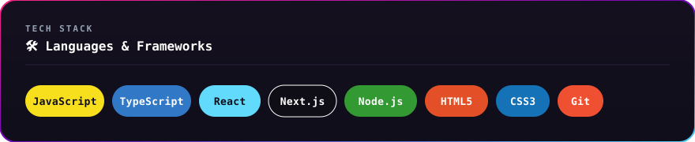
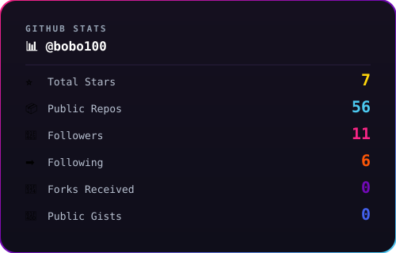
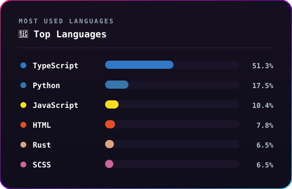
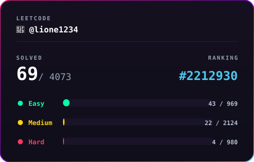

<p align="center">
  
</p>

## 🧑‍💻 個人資料

```yaml
name:    "Bobo"
email:   "w150lione@gmail.com"
blog:    "https://bobo100.dev/"
role:    "Frontend Developer"
hobbies: ["coding", "gaming", "youtube"]
```

## 📖 簡介

> *凡人持續努力。*

前端工程師，白天寫產品，下班做 side project —— 從配色工具、請客點餐到給家人用的影片下載器，喜歡把「自己真的會用到」的東西做到好用。

也在 [Kurau Blog](https://bobo100.dev) 記錄學過的技術、玩過的遊戲、看過的書和劇，偶爾在 [YouTube](https://www.youtube.com/channel/UC05WC738SwWj5wSiTSDd0Vg) 剪英雄聯盟的日常片段。

<br/>

<p align="center">
  
</p>

<br/>

## 🚀 作品

| 作品 | 說明 | 連結 |
|---|---|---|
| **Kurau Blog** | 記錄學過的技術、玩過的遊戲、看過的書與劇 | [bobo100.dev](https://bobo100.dev) |
| **Style Explorer** | 色票 + 真實網站預覽，即時換色、WCAG 對比檢查、一鍵匯出 CSS / Tailwind | [Demo](https://style-explorer-henna.vercel.app) · [Repo](https://github.com/Bobo100/style-explorer) |
| **迴聲 Vocal Studio** | 虛構歌唱教室官網重構：Astro 內容站 + Svelte 5 local-first 練習日誌 | [Demo](https://echo-vocal-studio.vercel.app) |
| **on me** | 請客點餐工具：金主開菜單、來客自助點、自動算每位金主要付多少 | [Demo](https://splitmenu.vercel.app) |

<details>
<summary>小工具與練習</summary>

| 作品 | 說明 | 連結 |
|---|---|---|
| 明日方舟抽卡模擬 | 抽卡機率與保底模擬 | [Demo](https://bobo100.github.io/arknights-gacha-sim/) · [Repo](https://github.com/Bobo100/arknights-gacha-sim) |
| 黑色沙漠小工具 | 自己方便用的黑沙計算工具 | [Demo](https://bobo100.github.io/black-desert-tool/) · [Repo](https://github.com/Bobo100/black-desert-tool) |
| 小畫家 Canvas-Paint | React + Canvas 線上小畫家 | [Demo](https://bobo100.github.io/canvas-paint/) · [Repo](https://github.com/Bobo100/canvas-paint) |
| React Hook 筆記 | 每個 Hook 一頁的互動教學 | [Demo](https://bobo100.github.io/react-hook-notes/) · [Repo](https://github.com/Bobo100/react-hook-notes) |

</details>

## ✍️ 最新文章

<!-- BLOG:START -->
- [人慈 - 橫跨二十萬年的人性旅程,用更好的視角看待自己 Humankind- A Hopeful History](https://bobo100.dev/book/%E4%BA%BA%E6%85%88-%E6%A9%AB%E8%B7%A8%E4%BA%8C%E5%8D%81%E8%90%AC%E5%B9%B4%E7%9A%84%E4%BA%BA%E6%80%A7%E6%97%85%E7%A8%8B-%E7%94%A8%E6%9B%B4%E5%A5%BD%E7%9A%84%E8%A6%96%E8%A7%92%E7%9C%8B%E5%BE%85%E8%87%AA%E5%B7%B1-humankind-a-hopeful-history)
- [書庫「皮膚」設計：書脊書架&lpar;bookshelf spine&rpar;與暖色 editorial](https://bobo100.dev/learning/%E6%9B%B8%E5%BA%AB%E7%9A%AE%E8%86%9A-bookshelf-spine-%E8%88%87-warm-editorial)
- [Async function-Await 函式](https://bobo100.dev/learning/async-function-await-%E5%87%BD%E5%BC%8F)
- [throw Error用法](https://bobo100.dev/learning/throw-error%E7%94%A8%E6%B3%95)
- [TypeScript 特性 - Interface](https://bobo100.dev/learning/typescript-%E7%89%B9%E6%80%A7-interface)
<!-- BLOG:END -->

## 🛠️ 最近更新的 repo

<!-- REPOS:START -->
- [youtube-to-your-format-rs](https://github.com/Bobo100/youtube-to-your-format-rs) — 給長輩用的 YouTube 下載 / 轉檔桌面程式(Tauri 2 + Rust) <sub>2026-10-10</sub>
- [style-explorer](https://github.com/Bobo100/style-explorer) · [Demo](https://style-explorer-henna.vercel.app) — 色票 + 真實網站預覽二合一工具,給沒學過色彩學的人用。即時換色 + WCAG 對比檢查 + 一鍵匯出 CSS/Tailwind。Next.js 16 + Tailwind 4。 <sub>2026-10-06</sub>
- [angels-online-afk-bot](https://github.com/Bobo100/angels-online-afk-bot) — 天使之戀自動掛機 <sub>2026-10-06</sub>
- [youtube-converter](https://github.com/Bobo100/youtube-converter) — 為了不太會用電腦的家人，寫一個簡單的功能，讓他可以抓youtube影片並且轉檔 <sub>2026-10-05</sub>
- [discord-pokemon-bot](https://github.com/Bobo100/discord-pokemon-bot) — Discord機器人與寶可夢自動抓寶系統 <sub>2026-10-05</sub>
<!-- REPOS:END -->

## 📺 Latest YouTube Videos

<!-- YOUTUBE:START -->
- [【百百】嘶嘶~蛇快要可以穿鞋了🤩](https://www.youtube.com/shorts/6VbUxv9WhYY)
- [【百百】最近迷上在你的鼻孔尿尿 #lolshorts  #lol  #大混戰 #Montagem Miau](https://www.youtube.com/shorts/VKizxgLEfWA)
- [【百百】各位聖誕節快樂🎅🎄🎁 #lolshorts  #lol  #大混戰](https://www.youtube.com/shorts/BOBi8qI_fJ4)
- [【百百】連敗列車是誰害的? #lolshorts  #lol  #leagueoflegends](https://www.youtube.com/shorts/y-r_SJ5ORec)
- [【百百】音不準 #lolshorts  #leagueoflegends  #宮崎駿](https://www.youtube.com/shorts/ROPQTb36rM4)
<!-- YOUTUBE:END -->

<br/>

<p align="center">
  
  
</p>

<p align="center">
  
</p>

<sub align="center">

Stats SVGs 由 [`.github/workflows/update-stats.yml`](.github/workflows/update-stats.yml) 每天自動重新產生,圖檔存在 [`assets/`](assets)。

</sub>

<p align="center">
  
</p>
